# ✈️ Airline Management System

A Java desktop application with MySQL database for managing flights, passengers, bookings, cancellations, and accounts. Features an animated dashboard, multi-role access (Admin & Passenger), and boarding pass generation.

---

## 📝 Description
Airline Management System allows users to manage flight details, passenger information, bookings, cancellations, and account management.  
- Admins can add flights, view customer details, and manage bookings.  
- Passengers can book and cancel tickets, view journey details, and generate boarding passes.

---

## ⚡ Features
- Animated Home Dashboard with welcome text  
- Flight management (Add / View details)  
- Passenger management  
- Booking and cancellation of tickets  
- Boarding pass generation  
- Journey details viewing  
- Multi-role access: Admin & Passenger  
- User-friendly GUI with hover effects  
- Integration with MySQL database

---

## 🗄️ Database Tables
- `account`  
- `cancel`  
- `flight`  
- `login`  
- `passenger`  
- `reservation`  

---

## 📸 Screenshots

### Home & Dashboard
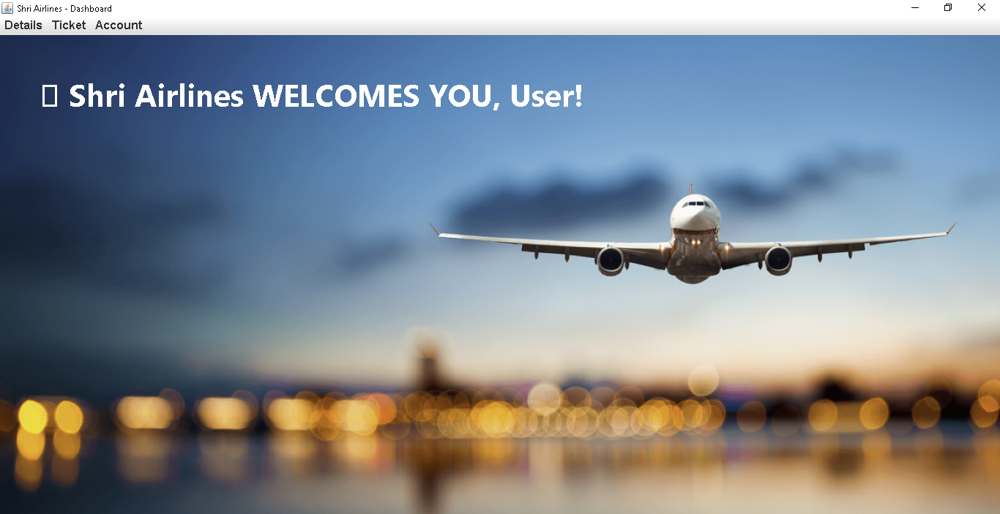  
  

### Flight Management
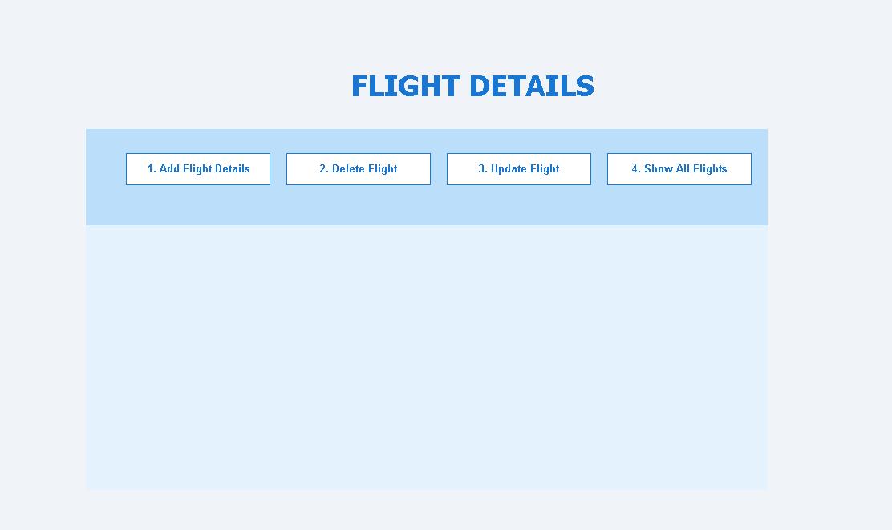  
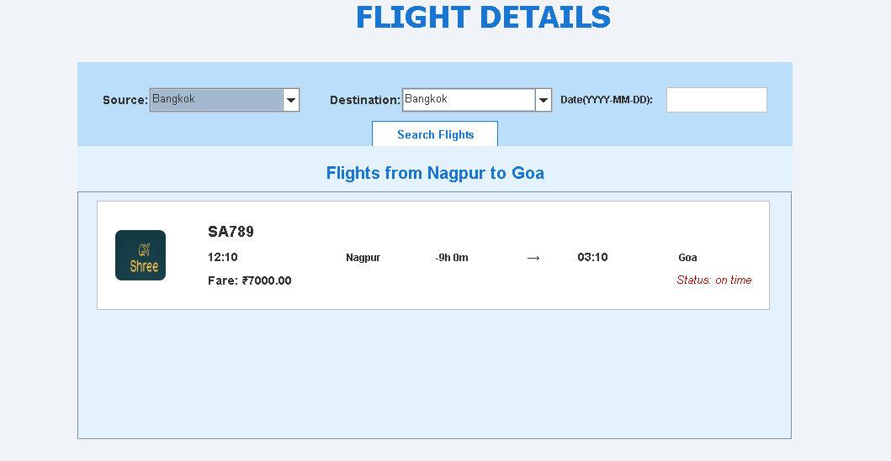  

### Booking
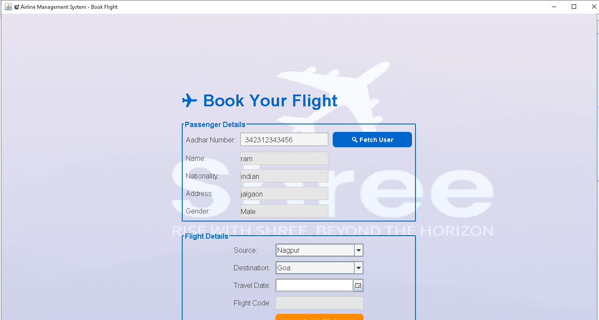  
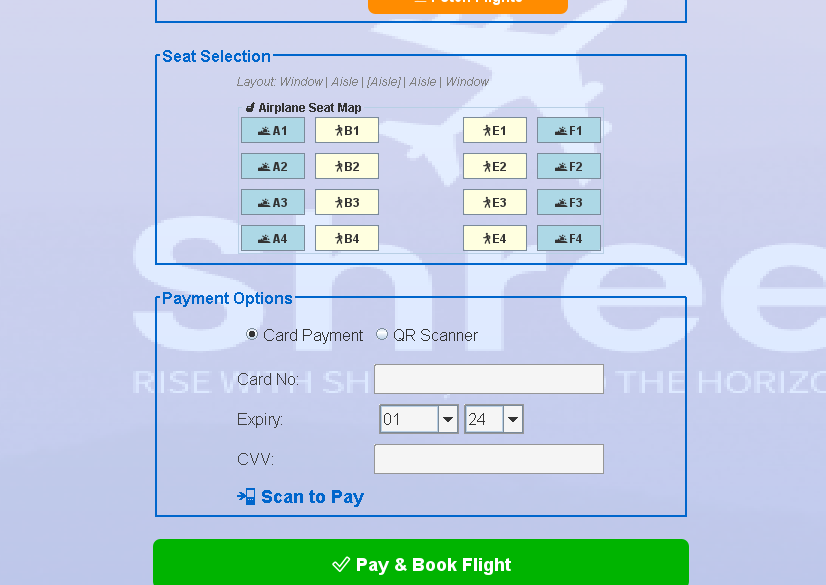  
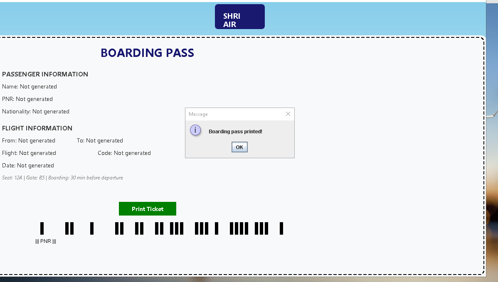  

### Customer & Account
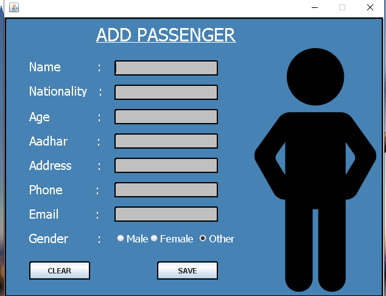  
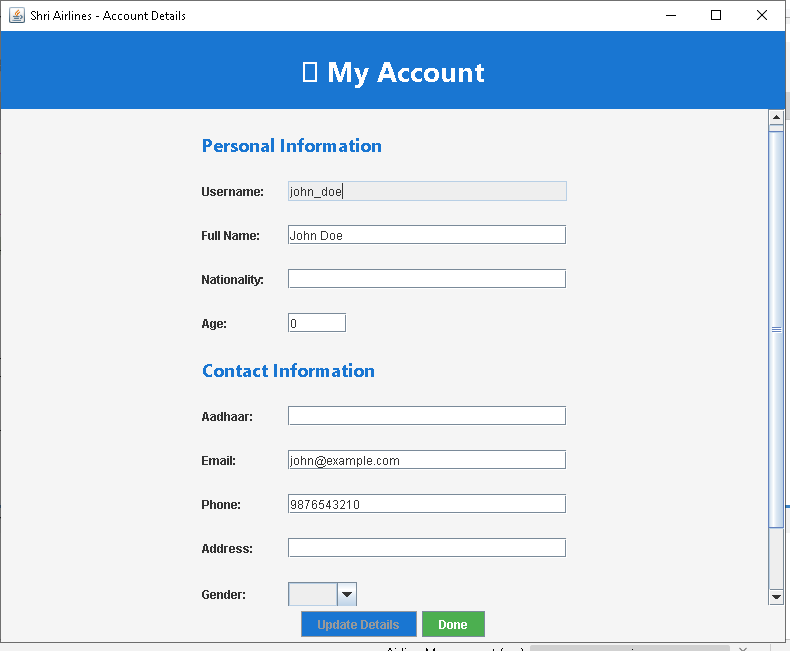  
  

### Cancellations
  

### Login & Logos
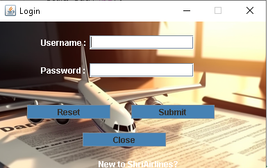  
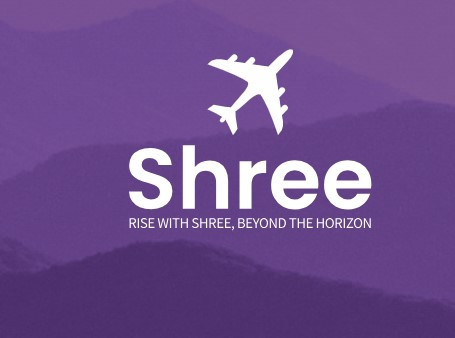  
  

### Other Screenshots
  
  
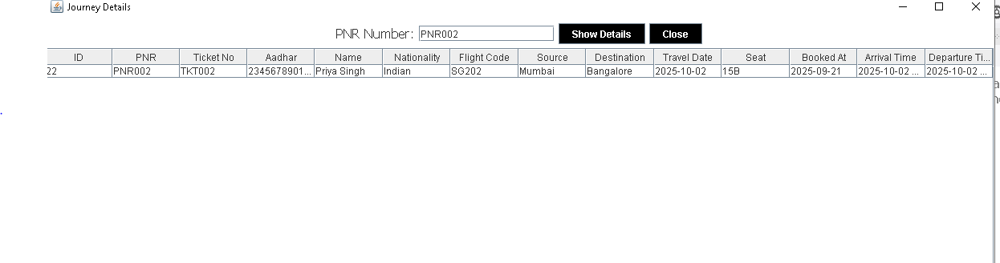  

---

## 🚀 How to Run
Clone the repository:  
```bash
git clone <your-repo-url>

